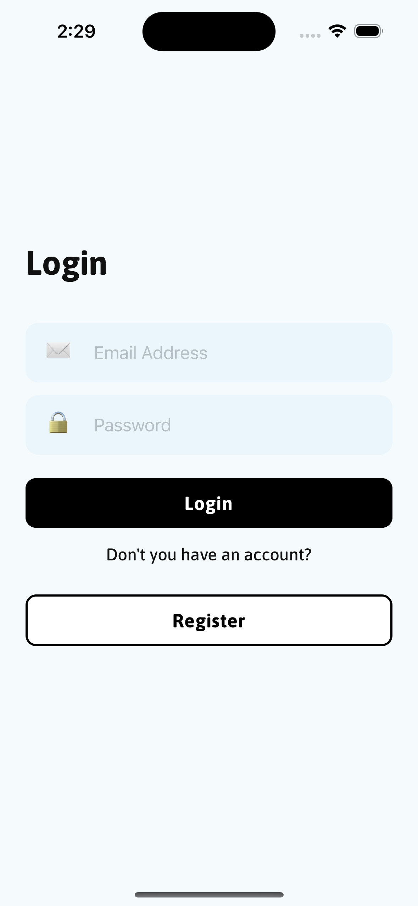
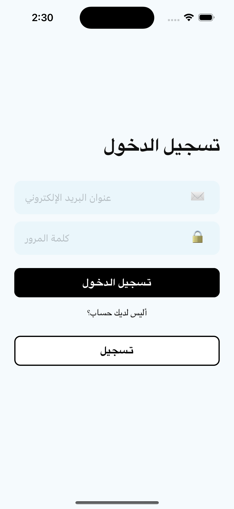
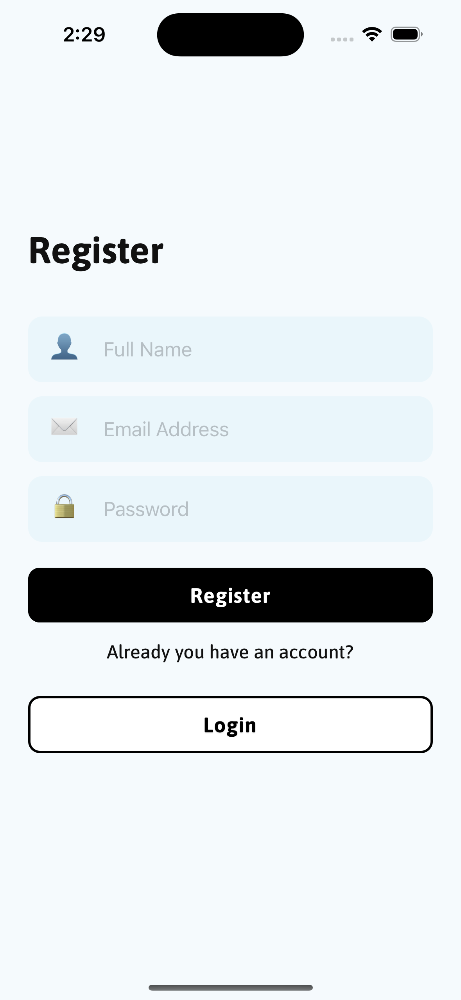
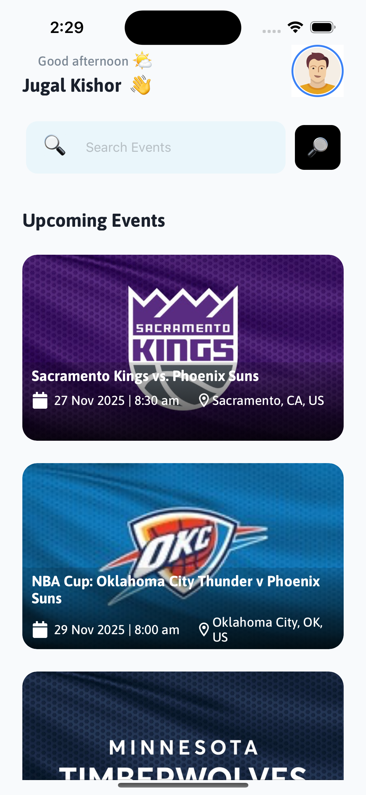
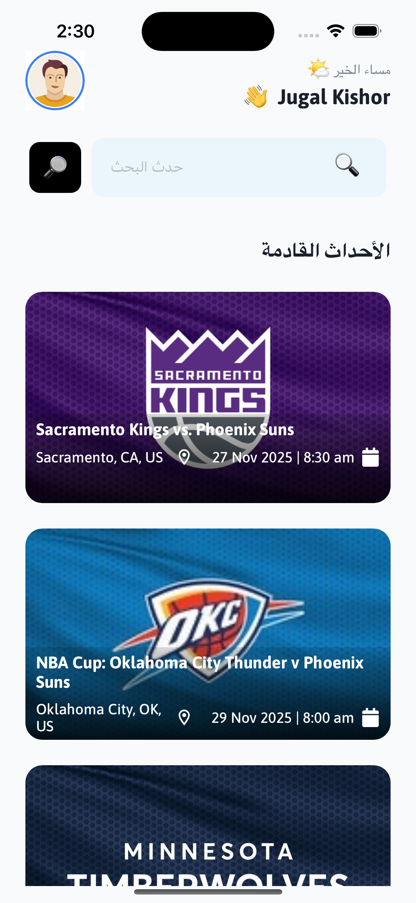
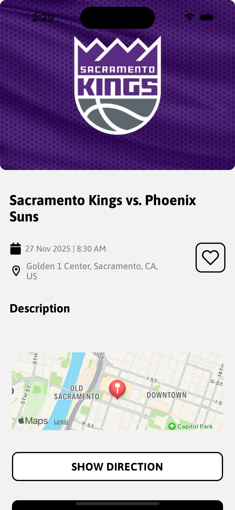
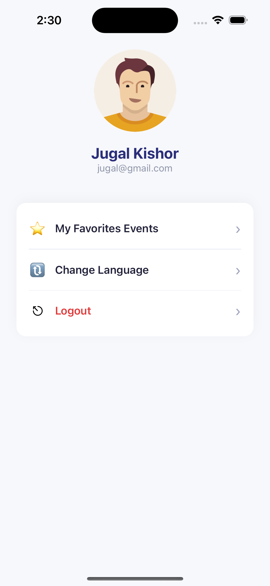
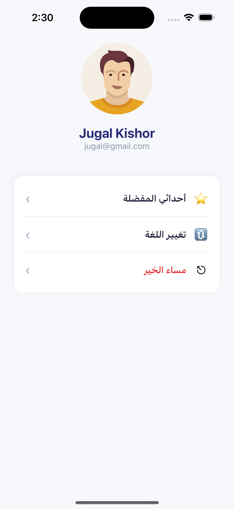

# 📱 CityPluse – React Native App

CityPluse is a modern React Native application built with **TypeScript**,  
**Redux**, **RTL support**, **Biometric Login**, and **Event Listing**  
using the Ticketmaster API.

---

## 🚀 Features

- 🔐 JWT Login + Biometric Login (Fingerprint / FaceID)
- 🌍 Multi-language Support (English + Arabic)
- ↔️ Dynamic RTL/LTR UI with full mirroring
- 🗺 Event List (Pagination + Infinite Scroll)
- 📍 Event Details with Google Maps Redirection
- 📡 API Integration (Ticketmaster Discovery API)
- 💾 AsyncStorage for persistence
- 🧭 React Navigation (Stack Navigation)

---

## 📸 Full App Demo

https://drive.google.com/file/d/1vwXT0Iu_KtI6SxIkHopssPznew5PkEqr/view?usp=sharing

## 📸 Screenshots

### 🔐 Login Screen

### 🔐 Register Screen

### 🏠 Home Screen

### 📄 Event Detail Screen

### 📄 Profile Screen

---
